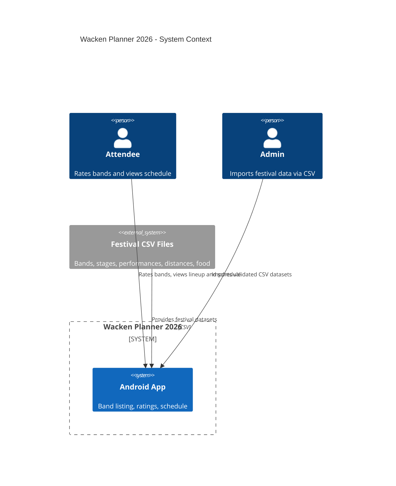
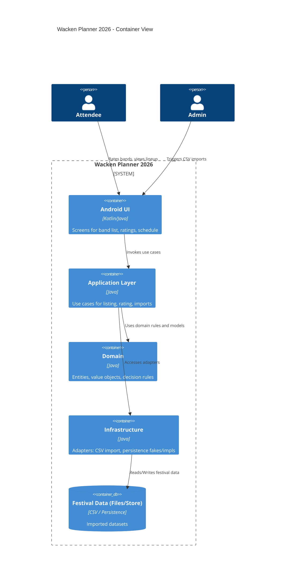

# Wacken Planner 2026

## Context
- Android app for Wacken Open Air 2026 helping friends rate bands and build a shared, conflict-aware schedule.
- Respects travel times between stages, lunch window, and veto rules when proposing timelines.

## Basic Functionality (MVP 1)
- Import festival data (bands, stages, performances, distances, food) from validated CSV files.
- List bands with stage and time information.
- Let users rate bands on a 0–4 scale (0 = veto, 4 = must-see).
- Prepare groundwork for group decision rules and printable timelines.

## Architecture
- Clean Architecture with DDD boundaries: domain, application, infrastructure, and Android UI modules.
- Business rules live in the domain; application orchestrates use cases; infrastructure provides adapters (e.g., CSV, persistence); Android module handles presentation only.
- Dependencies point inward only; UI never contains business logic.

### Technologies
- Language: Java
- Build: Gradle (Android)
- Testing: JUnit 5, Mockito/fakes; dedicated QA scenario suite planned
- Output: Debug APK via `./gradlew assembleDebug`

### C4: Level 1 (System Context)

### C4: Level 2 (Container)

## Setup and Run
1. Clone: `git clone git@github.com:DinoDeWaen/wacken.git` and `cd wacken`.
2. Ensure Java/Android SDK and Gradle wrapper are available.
3. Run tests: `./gradlew test` (include QA suite task when available).
4. Build debug APK: `./gradlew assembleDebug` (artifact in `app/build/outputs/apk/debug/`).

## Development Notes
- Follow TDD: write failing tests, implement, refactor.
- Keep commits small and focused; push incrementally for review visibility.
