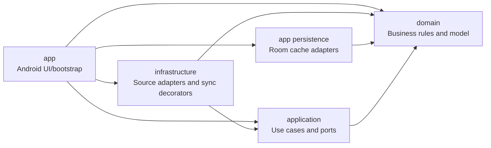
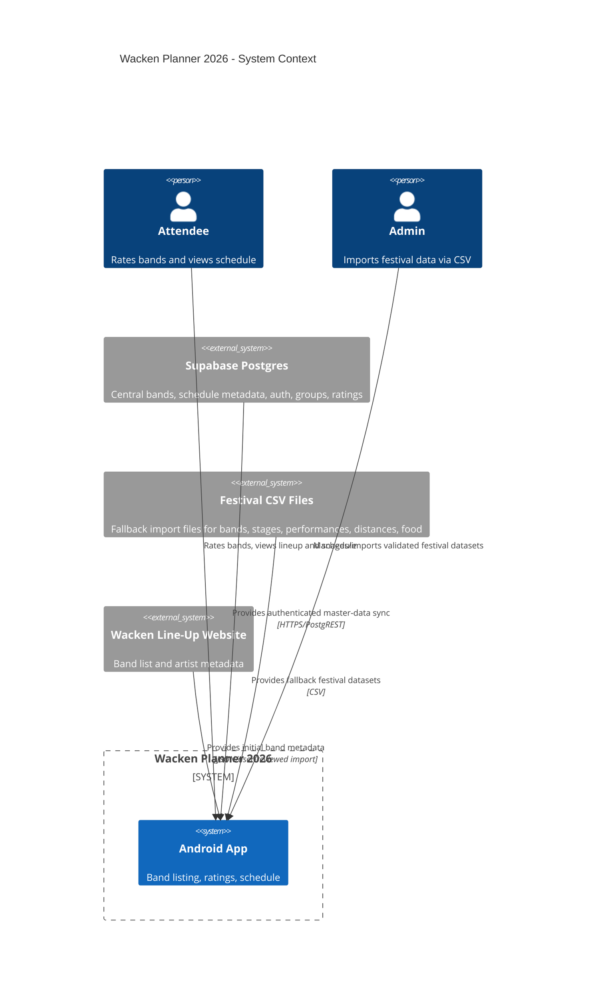
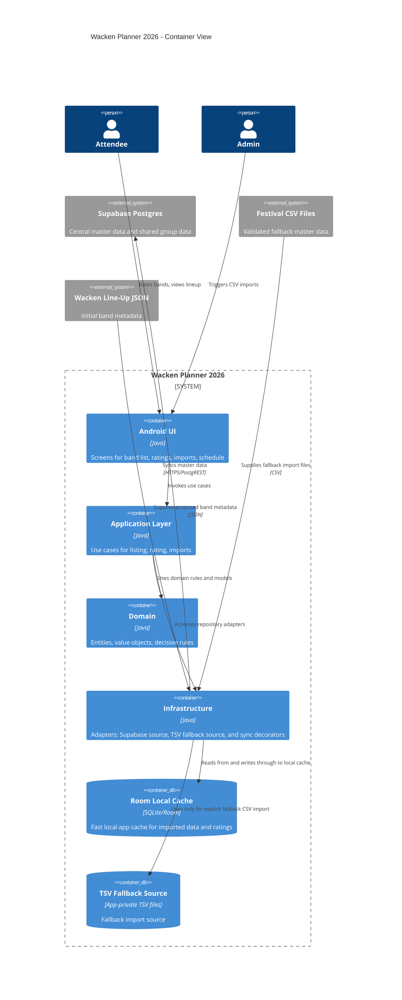

# Wacken Planner 2026

## Context
- Android app for Wacken Open Air 2026 helping friends rate bands and build a shared, conflict-aware schedule.
- Respects travel times between stages, lunch window, and veto rules when proposing timelines.

## Basic Functionality (MVP 1)
- Import festival data (bands, stages, performances, distances, food) from validated CSV files by selecting files in the Android import screen.
- Sync centrally managed festival master data from Supabase into the local Room cache on app start, overview reactivation, manual sync, and close.
- List bands in a compact dark table with Band, Rating, Stage, Date, and Time columns.
- Let users rate bands on a 1-5 scale (1 = veto, 5 = must-see), with 0 reserved for unrated bands/no filled stars, and clear a previous rating back to unrated.
- Save rating changes and clears locally immediately and sync pending/group ratings with Supabase when the app starts, reactivates, syncs manually, or closes.
- Open available YouTube and Spotify links from overview rows and band detail screens.
- Show imported English band biography/explanation and available band image metadata on the detail screen when `bands.csv` provides it.
- Sign in with Supabase Auth so ratings can be associated with a user and the shared Wacken planning group.
- Generate and view an MVP2 group schedule from shared ratings, conflict rules, optional decisions, and lost alternatives.
- Prepare groundwork for printable timelines.

## Architecture
- Clean Architecture with DDD boundaries: domain, application, infrastructure, and Android UI modules.
- Business rules live in the domain; application orchestrates use cases; infrastructure provides adapters (e.g., CSV, persistence); Android module handles presentation only.
- Dependencies point inward only; UI never contains business logic.
- ADR: [`0001-initial-android-clean-architecture-scaffold.md`](backlog/decisions/0001-initial-android-clean-architecture-scaffold.md).
- ADR: [`0003-github-actions-ci-and-apk-artifact.md`](backlog/decisions/0003-github-actions-ci-and-apk-artifact.md).
- ADR: [`0005-food-and-stage-repository-ports-for-csv-import.md`](backlog/decisions/0005-food-and-stage-repository-ports-for-csv-import.md).
- ADR: [`0006-mvp-file-backed-local-persistence.md`](backlog/decisions/0006-mvp-file-backed-local-persistence.md) (superseded).
- ADR: [`0007-room-local-cache-with-tsv-backend-source.md`](backlog/decisions/0007-room-local-cache-with-tsv-backend-source.md).
- ADR: [`0008-supabase-postgres-flyway-migrations.md`](backlog/decisions/0008-supabase-postgres-flyway-migrations.md).
- CSV schemas: [`festival-data-csv-schemas.md`](backlog/docs/festival-data-csv-schemas.md).
- MVP 1 UAT checklist and sample import files: [`mvp1-android-uat-checklist.md`](backlog/docs/mvp1-android-uat-checklist.md), [`samples/mvp1`](samples/mvp1).
- V1.1 release notes: [`releases/v1.1.md`](releases/v1.1.md).
- V1.0 release notes: [`releases/v1.0.md`](releases/v1.0.md).

### Module Map


```mermaid
flowchart LR
    app["app\nAndroid UI/bootstrap"]
    infrastructure["infrastructure\nSource adapters and sync decorators"]
    room["app persistence\nRoom cache adapters"]
    application["application\nUse cases and ports"]
    domain["domain\nBusiness rules and model"]

    app --> infrastructure
    app --> room
    app --> application
    app --> domain
    infrastructure --> application
    infrastructure --> domain
    room --> domain
    application --> domain
```

Current modules:

| Module | Type | Responsibility |
| --- | --- | --- |
| `domain` | Java library | Business concepts and rules. Must not depend on Android. |
| `application` | Java library | Use cases and ports. Depends on `domain`; must not depend on Android. |
| `infrastructure` | Java library | TSV backend-like source adapters, in-memory test adapters, and sync/write-through decorators. Depends inward on `application` and `domain`. |
| `app` | Android application | Android UI/bootstrap, APK packaging, and Room local-cache adapters. |

Current repositories cover bands, stages, performances, stage distances, food options, and ratings. The app reads lineup data from Room. Supabase is the primary master-data source for bands and schedule metadata; the CSV/TSV path remains as an explicit fallback/import tool. Android wiring composes Supabase or TSV source adapters, Room cache adapters, and sync decorators behind the existing domain repository ports.

### Technologies
- Language: Java
- Build: Gradle (Android)
- Local cache: AndroidX Room
- Backend database: Supabase Postgres, managed by Flyway SQL migrations
- Testing: JUnit 5, Mockito/fakes, JaCoCo coverage gates, and a dedicated `qaTest` scenario suite
- Output: Debug APK via `./gradlew assembleDebug`

### C4: Level 1 (System Context)


```mermaid
C4Context
    title Wacken Planner 2026 - System Context
    Person(attendee, "Attendee", "Rates bands and views schedule")
    Person(admin, "Admin", "Imports festival data via CSV")
    System_Boundary(app, "Wacken Planner 2026") {
        System(mobile, "Android App", "Band listing, ratings, schedule")
    }
    System_Ext(supabase, "Supabase Postgres", "Central bands, schedule metadata, auth, groups, ratings")
    System_Ext(csvSource, "Festival CSV Files", "Fallback import files for bands, stages, performances, distances, food")
    System_Ext(wackenSite, "Wacken Line-Up Website", "Band list and artist metadata")
    Rel(attendee, mobile, "Rates bands, views lineup and schedule")
    Rel(admin, mobile, "Manages/imports validated festival datasets")
    Rel(supabase, mobile, "Provides authenticated master-data sync", "HTTPS/PostgREST")
    Rel(csvSource, mobile, "Provides fallback festival datasets", "CSV")
    Rel(wackenSite, mobile, "Provides initial band metadata", "JSON/user-reviewed import")
```

### C4: Level 2 (Container)


```mermaid
C4Container
    title Wacken Planner 2026 - Container View
    Person(attendee, "Attendee")
    Person(admin, "Admin")
    System_Ext(supabase, "Supabase Postgres", "Central master data and shared group data")
    System_Ext(csvSource, "Festival CSV Files", "Validated fallback master data")
    System_Ext(wackenSite, "Wacken Line-Up JSON", "Initial band metadata")

    System_Boundary(app, "Wacken Planner 2026") {
        Container(ui, "Android UI", "Java", "Screens for band list, ratings, imports, schedule")
        Container(appsvc, "Application Layer", "Java", "Use cases for listing, rating, imports")
        Container(domain, "Domain", "Java", "Entities, value objects, decision rules")
        Container(infra, "Infrastructure", "Java", "Adapters: Supabase source, TSV fallback source, and sync decorators")
        ContainerDb(cache, "Room Local Cache", "SQLite/Room", "Fast local app cache for imported data and ratings")
        ContainerDb(tsv, "TSV Fallback Source", "App-private TSV files", "Fallback import source")
    }

    Rel(attendee, ui, "Rates bands, views lineup")
    Rel(admin, ui, "Triggers CSV imports")
    Rel(ui, appsvc, "Invokes use cases")
    Rel(appsvc, domain, "Uses domain rules and models")
    Rel(appsvc, infra, "Accesses repository adapters")
    Rel(infra, cache, "Reads from and writes through to local cache")
    Rel(infra, supabase, "Syncs master data", "HTTPS/PostgREST")
    Rel(infra, tsv, "Uses only for explicit fallback CSV import")
    Rel(csvSource, infra, "Supplies fallback import files", "CSV")
    Rel(wackenSite, infra, "Supplies proposed band metadata", "JSON")
```

## Setup and Run
1. Clone: `git clone git@github.com:DinoDeWaen/wacken.git` and `cd wacken`.
2. Ensure JDK 21 and Android SDK are installed. The current Gradle and Android plugin stack is validated with JDK 21 and Android SDK 36.
3. Create `local.properties` if needed:

   ```properties
   sdk.dir=/absolute/path/to/Android/sdk
   ```

4. Run tests: `./gradlew test` (include QA suite task when available).
5. Run QA scenarios: `./gradlew qaTest`.
6. Build debug APK: `./gradlew assembleDebug` (artifact in `app/build/outputs/apk/debug/`).

Useful module checks:

```bash
JAVA_HOME=$(/usr/libexec/java_home -v 21) ./gradlew test
JAVA_HOME=$(/usr/libexec/java_home -v 21) ./gradlew qaTest
JAVA_HOME=$(/usr/libexec/java_home -v 21) ./gradlew assembleDebug
```

Useful focused checks:

```bash
./gradlew :domain:compileJava :application:compileJava
./gradlew :domain:test :application:test
./gradlew :domain:jacocoTestCoverageVerification :application:jacocoTestCoverageVerification
./gradlew qaTest
```

## Backend Database

Supabase Postgres is the planned central backend for shared ratings and admin
managed festival data. Flyway migrations live in:

```text
backend/flyway/sql
```

Local credentials must stay outside git. Create `.env.supabase.local` from the
template:

```bash
cp backend/flyway/env.template .env.supabase.local
```

Fill in the local password in `.env.supabase.local`. This file is ignored by
git. Do not commit database passwords, service-role keys, or other secrets.

Run Flyway:

```bash
backend/flyway/run-flyway.sh info
backend/flyway/run-flyway.sh migrate
backend/flyway/run-flyway.sh info
```

The script uses locally installed `flyway` when available and falls back to
Docker otherwise. Band import uses local `psql`; set `PSQL_BIN` if `psql` is
installed but not on `PATH`.

Upload the generated Wacken bands CSV to Supabase:

```bash
backend/flyway/import-bands.sh
backend/flyway/verify-bands-import.sh
backend/flyway/verify-auth-setup.sh
```

The band import is idempotent. Re-running it upserts the CSV rows and marks
bands missing from the CSV as inactive rather than deleting rows.

Admin master-data import for the full CSV set:

```bash
backend/flyway/import-master-data.sh
```

By default this imports:

```text
data/wacken-2026/bands.csv
data/wacken-2026/stages.csv
data/wacken-2026/performances.csv
data/wacken-2026/distances.csv
data/wacken-2026/food.csv
```

Override individual files with `BANDS_CSV`, `STAGES_CSV`,
`PERFORMANCES_CSV`, `DISTANCES_CSV`, and `FOOD_CSV`. The importer records a
row in `public.import_batches`, validates references, duplicate ids, invalid
performance times, stage overlaps, negative walking minutes, and food/stage
references, then applies the import in one transaction. Failed imports update
their import batch to `failed` and leave existing master data unchanged.

The Android band overview reads from Room and automatically syncs from Supabase
when the app starts and whenever the overview is reactivated after returning
from another screen or app. Use **Sync from Supabase** to retry manually. Use
**Sync & close** to push/pull Supabase data before closing the app. Each sync
pulls central bands, stages, performances, stage distances, and food options
from Supabase into Room and pushes/pulls group ratings. Rating changes and
rating clears are stored locally first with pending sync metadata; when Supabase
accepts the rating change it is marked synced. Clearing a rating deletes that
explicit user/group/band rating row in Supabase, so future group pulls no longer
count the previous score. If sync fails, existing cached Room data and pending
ratings remain available and the app shows a stale-data message. A Wacken/metal
sync overlay is shown while startup, reactivation, manual, or close sync is
running. The CSV import screen remains available for fallback/local import work
and writes through the TSV fallback source plus Room cache; it is no longer the
primary app data source.

Rating scale migration: app database version 3 migrates old local explicit
ratings from the previous 0-4 scale to the new 1-5 explicit scale by adding 1
to stored rating rows. Flyway migration `V005__rating_scale_1_to_5.sql` applies
the same conversion in Supabase and then constrains backend explicit ratings to
1-5. TSV fallback rating files have no schema version; clear or regenerate old
`ratings.tsv` fallback data before release if it contains ratings written
before this migration.

### Supabase Auth

The Android app uses Supabase Auth email/password sign-in and compiles only the
public Supabase URL and anon key into `BuildConfig`. Keep database passwords and
service-role keys out of the app and out of git.

Required Supabase project settings:

- Enable the Email provider in Authentication.
- Create or invite app users through Supabase Authentication.
- Run Flyway migrations so the `auth.users` trigger creates a matching
  `public.profiles` row and assigns new users to the shared `Sofie and Dino`
  group.

The current MVP uses one shared planning group, `Sofie and Dino`:

```text
00000000-0000-0000-0000-000000000001
```

Migration `V006__sofie_dino_group_backfill.sql` keeps that canonical group id,
sets the group name to `Sofie and Dino`, and idempotently adds every existing
Supabase auth user to the group.

Group role data is stored in `public.group_members.role`. To promote a user for
future admin workflows, update that user's membership role to `admin` or `owner`
and, when platform-wide access is required, set `public.profiles.is_admin`.
Ratings remain protected by RLS: an authenticated user can read/write private
ratings only when they belong to the rating's group. Rating inserts and updates
also require `ratings.user_id = auth.uid()`, so a request cannot write another
member's rating even when the caller belongs to the same group.

The app stores Supabase access and refresh tokens locally. Authenticated
Supabase requests refresh an expired access token before sending the request and
retry once when Supabase rejects a request because the JWT expired. If the
refresh token is invalid, expired, or revoked, the local session is cleared and
the user is sent back to login.

Coverage gates:

- `domain`: 80% minimum instruction coverage.
- `application`: 70% minimum instruction coverage.

## Troubleshooting

If Gradle fails while creating `:application:test` with `Type T not present`, check the active Java version:

```bash
java -version
```

This project is currently validated with JDK 21. On macOS, run Gradle with JDK 21 explicitly:

```bash
JAVA_HOME=$(/usr/libexec/java_home -v 21) ./gradlew test
JAVA_HOME=$(/usr/libexec/java_home -v 21) ./gradlew qaTest
JAVA_HOME=$(/usr/libexec/java_home -v 21) ./gradlew assembleDebug
```

The failure has been reproduced with Java 25 as the launcher JVM.

## CI

GitHub Actions runs on push and pull request.

The CI workflow:

- Sets up JDK 21 and the Android SDK.
- Runs `./gradlew test`, including the current JUnit 5 tests and JaCoCo coverage gates.
- Runs `./gradlew qaTest` for MVP listing/rating scenario coverage.
- Runs `./gradlew assembleDebug`.
- Publishes `app/build/outputs/apk/debug/app-debug.apk` as a versioned artifact named `wacken-planner-0.1.<run-number>-debug-apk`.

## Development Notes
- Follow TDD: write failing tests, implement, refactor.
- Keep commits small and focused; push incrementally for review visibility.
- Ways of working: [`development-ways-of-working.md`](backlog/docs/development-ways-of-working.md).
- Testing strategy: [`testing-strategy.md`](backlog/docs/testing-strategy.md).
- Architecture guidelines: [`architecture-guidelines.md`](backlog/docs/architecture-guidelines.md).
- ADR rules: [`architecture-decision-rules.md`](backlog/docs/architecture-decision-rules.md).
- Diagramming guidelines: [`diagramming-guidelines.md`](backlog/docs/diagramming-guidelines.md).
