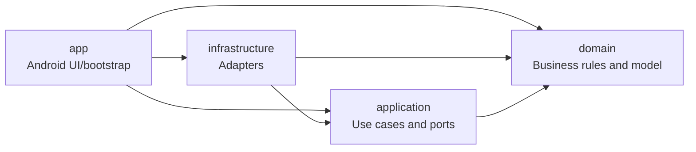
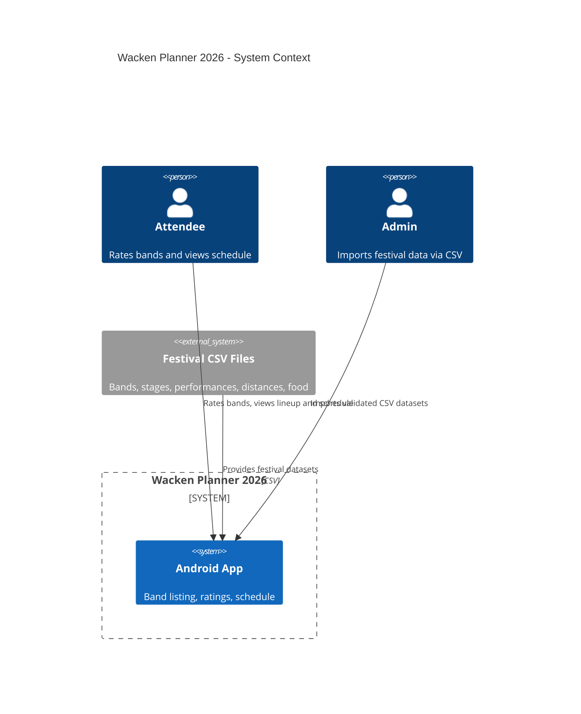
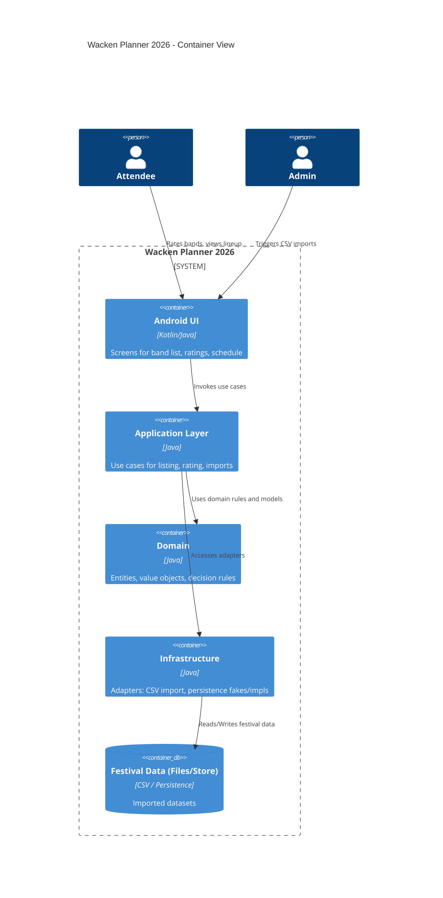

# Wacken Planner 2026

## Context
- Android app for Wacken Open Air 2026 helping friends rate bands and build a shared, conflict-aware schedule.
- Respects travel times between stages, lunch window, and veto rules when proposing timelines.

## Basic Functionality (MVP 1)
- Import festival data (bands, stages, performances, distances, food) from validated CSV files.
- List bands with stage and time information.
- Let users rate bands on a 0–4 scale (0 = veto, 4 = must-see).
- Prepare groundwork for group decision rules and printable timelines.

## Architecture
- Clean Architecture with DDD boundaries: domain, application, infrastructure, and Android UI modules.
- Business rules live in the domain; application orchestrates use cases; infrastructure provides adapters (e.g., CSV, persistence); Android module handles presentation only.
- Dependencies point inward only; UI never contains business logic.
- ADR: [`0001-initial-android-clean-architecture-scaffold.md`](backlog/decisions/0001-initial-android-clean-architecture-scaffold.md).
- ADR: [`0003-github-actions-ci-and-apk-artifact.md`](backlog/decisions/0003-github-actions-ci-and-apk-artifact.md).
- ADR: [`0005-food-and-stage-repository-ports-for-csv-import.md`](backlog/decisions/0005-food-and-stage-repository-ports-for-csv-import.md).
- CSV schemas: [`festival-data-csv-schemas.md`](backlog/docs/festival-data-csv-schemas.md).

### Module Map


```mermaid
flowchart LR
    app["app\nAndroid UI/bootstrap"]
    infrastructure["infrastructure\nAdapters"]
    application["application\nUse cases and ports"]
    domain["domain\nBusiness rules and model"]

    app --> infrastructure
    app --> application
    app --> domain
    infrastructure --> application
    infrastructure --> domain
    application --> domain
```

Current modules:

| Module | Type | Responsibility |
| --- | --- | --- |
| `domain` | Java library | Business concepts and rules. Must not depend on Android. |
| `application` | Java library | Use cases and ports. Depends on `domain`; must not depend on Android. |
| `infrastructure` | Java library | Technical adapters. Depends inward on `application` and `domain`. |
| `app` | Android application | Android UI/bootstrap and APK packaging. |

Current import repositories cover bands, stages, performances, stage distances, food options, and ratings.

### Technologies
- Language: Java
- Build: Gradle (Android)
- Testing: JUnit 5, Mockito/fakes, JaCoCo coverage gates, and a dedicated `qaTest` scenario suite
- Output: Debug APK via `./gradlew assembleDebug`

### C4: Level 1 (System Context)


```mermaid
C4Context
    title Wacken Planner 2026 - System Context
    Person(attendee, "Attendee", "Rates bands and views schedule")
    Person(admin, "Admin", "Imports festival data via CSV")
    System_Boundary(app, "Wacken Planner 2026") {
        System(mobile, "Android App", "Band listing, ratings, schedule")
    }
    System_Ext(csvSource, "Festival CSV Files", "Bands, stages, performances, distances, food")
    Rel(attendee, mobile, "Rates bands, views lineup and schedule")
    Rel(admin, mobile, "Imports validated CSV datasets")
    Rel(csvSource, mobile, "Provides festival datasets", "CSV")
```

### C4: Level 2 (Container)


```mermaid
C4Container
    title Wacken Planner 2026 - Container View
    Person(attendee, "Attendee")
    Person(admin, "Admin")

    System_Boundary(app, "Wacken Planner 2026") {
        Container(ui, "Android UI", "Kotlin/Java", "Screens for band list, ratings, schedule")
        Container(appsvc, "Application Layer", "Java", "Use cases for listing, rating, imports")
        Container(domain, "Domain", "Java", "Entities, value objects, decision rules")
        Container(infra, "Infrastructure", "Java", "Adapters: CSV import, persistence fakes/impls")
        ContainerDb(data, "Festival Data (Files/Store)", "CSV / Persistence", "Imported datasets")
    }

    Rel(attendee, ui, "Rates bands, views lineup")
    Rel(admin, ui, "Triggers CSV imports")
    Rel(ui, appsvc, "Invokes use cases")
    Rel(appsvc, domain, "Uses domain rules and models")
    Rel(appsvc, infra, "Accesses adapters")
    Rel(infra, data, "Reads/Writes festival data")
```

## Setup and Run
1. Clone: `git clone git@github.com:DinoDeWaen/wacken.git` and `cd wacken`.
2. Ensure JDK 17+ and Android SDK are installed. The current local validation used JDK 21 and Android SDK 36.
3. Create `local.properties` if needed:

   ```properties
   sdk.dir=/absolute/path/to/Android/sdk
   ```

4. Run tests: `./gradlew test` (include QA suite task when available).
5. Run QA scenarios: `./gradlew qaTest`.
6. Build debug APK: `./gradlew assembleDebug` (artifact in `app/build/outputs/apk/debug/`).

Useful module checks:

```bash
./gradlew :domain:compileJava :application:compileJava
./gradlew :domain:test :application:test
./gradlew :domain:jacocoTestCoverageVerification :application:jacocoTestCoverageVerification
./gradlew qaTest
```

Coverage gates:

- `domain`: 80% minimum instruction coverage.
- `application`: 70% minimum instruction coverage.

## CI

GitHub Actions runs on push and pull request.

The CI workflow:

- Sets up JDK 21 and the Android SDK.
- Runs `./gradlew test`, including the current JUnit 5 tests and JaCoCo coverage gates.
- Runs `./gradlew qaTest` for MVP listing/rating scenario coverage.
- Runs `./gradlew assembleDebug`.
- Publishes `app/build/outputs/apk/debug/app-debug.apk` as a versioned artifact named `wacken-planner-0.1.<run-number>-debug-apk`.

## Development Notes
- Follow TDD: write failing tests, implement, refactor.
- Keep commits small and focused; push incrementally for review visibility.
- Ways of working: [`development-ways-of-working.md`](backlog/docs/development-ways-of-working.md).
- Testing strategy: [`testing-strategy.md`](backlog/docs/testing-strategy.md).
- Architecture guidelines: [`architecture-guidelines.md`](backlog/docs/architecture-guidelines.md).
- ADR rules: [`architecture-decision-rules.md`](backlog/docs/architecture-decision-rules.md).
- Diagramming guidelines: [`diagramming-guidelines.md`](backlog/docs/diagramming-guidelines.md).
